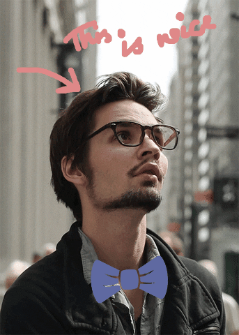

# GifCanvas

GifCanvas is a simple browser-based tool that allows users to edit their GIFs. With this application, you can personalize your GIFs by scribbling on them using a pen tool or by adding stickers to enhance their visual appeal.

## Getting Started

To run GifCanvas locally on your machine, follow these steps:

1. **Clone the Repository**: If you haven't already, clone this repository to your local machine.
2. **Install Dependencies**: Navigate to the project directory and run `bun install` to install the necessary dependencies.
3. **Start the Development Server**: Execute `bun dev` to start the development server.
4. **Open in Browser**: Once the server is running, open your web browser and navigate to `http://localhost:5173` (or the port specified in the terminal) to access the application.

Now you're ready to edit your GIFs with GifCanvas!

## Sample Output

This is a sample output demonstrating freestyle sketching and sticker integration on a GIF using GifCanvas.
